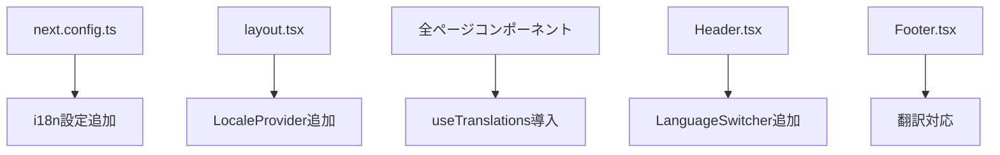

# 多言語対応（i18n）実装計画書

## 📋 概要

| 項目 | 内容 |
|------|------|
| 目的 | AI Voice RecorderのUIを日本語・英語・スペイン語に対応 |
| 対象 | Webフロントエンド（Next.js App Router） |
| 推定工数 | 2-3時間 |
| 技術スタック | next-intl |
| 優先度 | 中 |

---

## 🎯 要件定義

### 機能要件
1. **対応言語**: 日本語（ja）、英語（en）、スペイン語（es）
2. **言語切り替え**: ヘッダーまたは設定ページから切り替え可能
3. **言語保持**: ブラウザに言語設定を保存（localStorage）
4. **自動検出**: 初回アクセス時はブラウザ言語を自動検出
5. **URL構造**: パスベース（`/ja/`, `/en/`, `/es/`）またはクッキーベース

### 非機能要件
1. **パフォーマンス**: 言語切り替え時にページリロードなし（SPA的挙動）
2. **SEO**: 各言語ページが適切にインデックスされる
3. **保守性**: 翻訳ファイルの追加・修正が容易
4. **型安全性**: TypeScriptによる翻訳キーの型チェック

---

## 🔧 技術選定

### 候補ライブラリ比較

| ライブラリ | App Router対応 | 型安全性 | 学習コスト | 備考 |
|-----------|---------------|----------|-----------|------|
| **next-intl** | ✅ 完全対応 | ✅ 優秀 | 低 | **推奨** |
| next-i18next | ⚠️ Pages Router向け | ⚠️ 普通 | 中 | App Router非推奨 |
| react-i18next | ⚠️ 追加設定必要 | ⚠️ 普通 | 中 | Next.js特化ではない |
| lingui | ✅ 対応 | ✅ 優秀 | 高 | 設定が複雑 |

### 選定理由: next-intl

1. **Next.js App Router完全対応**: Server Components、Client Components両方で使用可能
2. **型安全性**: TypeScriptとの統合が優秀、翻訳キーの補完が効く
3. **軽量**: バンドルサイズへの影響が最小限
4. **Static Export対応**: 現在のビルド方式（`output: 'export'`）と互換
5. **活発なメンテナンス**: Next.js公式ドキュメントでも推奨

---

## 📐 アーキテクチャ設計

### ディレクトリ構造（変更後）

```
airecorder/web/
├── messages/                    # 翻訳ファイル（新規）
│   ├── ja.json                 # 日本語
│   ├── en.json                 # 英語
│   └── es.json                 # スペイン語
├── src/
│   ├── i18n/                   # i18n設定（新規）
│   │   ├── config.ts           # 言語設定
│   │   ├── request.ts          # Server Component用
│   │   └── navigation.ts       # ナビゲーション設定
│   ├── app/
│   │   └── [locale]/           # 動的ルート（全ページ移動）
│   │       ├── layout.tsx
│   │       ├── page.tsx
│   │       ├── history/
│   │       ├── settings/
│   │       ├── recording/
│   │       ├── privacy/
│   │       └── terms/
│   └── components/
│       └── layout/
│           └── LanguageSwitcher.tsx  # 言語切り替えUI（新規）
├── middleware.ts               # 言語リダイレクト（新規）
└── next.config.ts              # 設定更新
```

### Static Export対応

**重要**: 現在`output: 'export'`（静的サイト生成）を使用しているため、`middleware.ts`による動的リダイレクトは使用不可。

**代替アプローチ**:
1. **クライアントサイドでの言語検出**: `useEffect`でブラウザ言語を検出
2. **Cookie/localStorage保存**: 選択した言語を保持
3. **generateStaticParams**: 全言語のページを事前生成

```typescript
// app/[locale]/layout.tsx
export function generateStaticParams() {
  return [{ locale: 'ja' }, { locale: 'en' }, { locale: 'es' }];
}
```

---

## 📝 翻訳対象テキスト分析

### ページ別テキスト数

| ページ | 翻訳対象数 | 複雑度 |
|--------|-----------|--------|
| トップページ（録音） | 約50個 | 高 |
| 履歴ページ | 約20個 | 中 |
| 設定ページ | 約30個 | 中 |
| 録音詳細ページ | 約35個 | 高 |
| プライバシーポリシー | 約15セクション | 中 |
| 利用規約 | 約12セクション | 中 |
| ヘッダー/フッター | 約15個 | 低 |
| **合計** | **約180個** | - |

### 翻訳カテゴリ

```json
{
  "common": {
    "save": "保存",
    "cancel": "キャンセル",
    "delete": "削除",
    "loading": "読み込み中...",
    "error": "エラー"
  },
  "navigation": {
    "recording": "録音",
    "history": "履歴",
    "settings": "設定"
  },
  "recording": {
    "title": "AI Voice Recorder",
    "description": "音声を録音して、リアルタイムで文字起こし＆翻訳",
    "startRecording": "録音開始",
    "stopRecording": "録音停止"
  },
  "history": { ... },
  "settings": { ... },
  "privacy": { ... },
  "terms": { ... }
}
```

---

## 🔄 依存関係分析

### 影響を受けるファイル



### パッケージ依存関係

```json
{
  "dependencies": {
    "next-intl": "^3.x"  // 追加
  }
}
```

### 既存機能への影響

| 機能 | 影響 | 対策 |
|------|------|------|
| 録音・文字起こし | なし | - |
| 翻訳機能 | なし | - |
| 履歴表示 | なし | - |
| API通信 | なし | - |
| 音声入力言語選択 | **あり** | 言語名の翻訳対応 |
| 日付フォーマット | **あり** | ロケール対応 |

---

## ⚠️ リスクと対策

### リスク1: Static Export非互換
- **リスク**: next-intlの一部機能がStatic Exportで動作しない
- **影響度**: 高
- **対策**: 
  - クライアントサイドナビゲーションを使用
  - `generateStaticParams`で全ページ事前生成
  - `unstable_setRequestLocale`の使用

### リスク2: パフォーマンス劣化
- **リスク**: 翻訳ファイルのサイズによるバンドル増加
- **影響度**: 低
- **対策**:
  - 言語ごとにファイル分割（自動的にコード分割される）
  - 必要な言語のみロード

### リスク3: SEO影響
- **リスク**: 言語切り替えがSEOに悪影響
- **影響度**: 中
- **対策**:
  - `hreflang`タグの追加
  - 各言語ページに正しい`lang`属性
  - sitemap.xmlの多言語対応

### リスク4: 翻訳漏れ
- **リスク**: 一部テキストが翻訳されない
- **影響度**: 中
- **対策**:
  - TypeScriptによる型チェック
  - 翻訳キーの自動抽出ツール使用
  - テスト時の目視確認

---

## 📋 実装タスク

### Phase 1: 基盤構築（30分）

| # | タスク | 担当ファイル |
|---|--------|-------------|
| 1.1 | next-intlインストール | package.json |
| 1.2 | i18n設定ファイル作成 | src/i18n/*.ts |
| 1.3 | next.config.ts更新 | next.config.ts |
| 1.4 | 翻訳ファイル作成（空） | messages/*.json |

### Phase 2: ルーティング対応（30分）

| # | タスク | 担当ファイル |
|---|--------|-------------|
| 2.1 | [locale]ディレクトリ作成 | src/app/[locale]/ |
| 2.2 | 既存ページを移動 | 全ページファイル |
| 2.3 | layout.tsx更新 | src/app/[locale]/layout.tsx |
| 2.4 | generateStaticParams設定 | layout.tsx |

### Phase 3: 翻訳ファイル作成（45分）

| # | タスク | 担当ファイル |
|---|--------|-------------|
| 3.1 | 日本語翻訳ファイル | messages/ja.json |
| 3.2 | 英語翻訳ファイル | messages/en.json |
| 3.3 | スペイン語翻訳ファイル | messages/es.json |

### Phase 4: コンポーネント更新（60分）

| # | タスク | 担当ファイル |
|---|--------|-------------|
| 4.1 | Header翻訳対応 | Header.tsx |
| 4.2 | Footer翻訳対応 | Footer.tsx |
| 4.3 | トップページ翻訳対応 | page.tsx |
| 4.4 | 履歴ページ翻訳対応 | history/page.tsx |
| 4.5 | 設定ページ翻訳対応 | settings/page.tsx |
| 4.6 | 録音詳細ページ翻訳対応 | recording/page.tsx |
| 4.7 | プライバシーポリシー翻訳対応 | privacy/page.tsx |
| 4.8 | 利用規約翻訳対応 | terms/page.tsx |

### Phase 5: 言語切り替えUI（15分）

| # | タスク | 担当ファイル |
|---|--------|-------------|
| 5.1 | LanguageSwitcher作成 | LanguageSwitcher.tsx |
| 5.2 | Headerに統合 | Header.tsx |
| 5.3 | スタイリング調整 | - |

### Phase 6: テスト・修正（30分）

| # | タスク | 内容 |
|---|--------|------|
| 6.1 | ローカルビルドテスト | npm run build |
| 6.2 | 全言語の画面確認 | 目視確認 |
| 6.3 | 翻訳漏れ修正 | - |
| 6.4 | デプロイ | swa deploy |

---

## 🧪 テスト計画

### 単体テスト
- [ ] 各言語ファイルのJSON構文チェック
- [ ] 翻訳キーの一致確認（全言語で同じキーが存在するか）

### 結合テスト
- [ ] 言語切り替え動作確認
- [ ] 言語設定の永続化確認（リロード後も保持）
- [ ] 全ページの表示確認（各言語）

### E2Eテスト
- [ ] 録音→保存→履歴表示の一連フロー（各言語）
- [ ] 設定変更の反映確認

---

## 📅 スケジュール

```
Phase 1 (基盤構築)      ████░░░░░░ 30分
Phase 2 (ルーティング)   ████░░░░░░ 30分
Phase 3 (翻訳ファイル)   ██████░░░░ 45分
Phase 4 (コンポーネント) ████████░░ 60分
Phase 5 (切り替えUI)     ██░░░░░░░░ 15分
Phase 6 (テスト)         ████░░░░░░ 30分
─────────────────────────────────────
合計                               3時間30分
```

---

## 📎 補足：翻訳サンプル

### messages/ja.json（一部）
```json
{
  "app": {
    "title": "AI Voice Recorder",
    "description": "音声を録音して、リアルタイムで文字起こし＆翻訳"
  },
  "navigation": {
    "recording": "録音",
    "history": "履歴",
    "settings": "設定"
  },
  "recording": {
    "start": "録音開始",
    "stop": "録音停止",
    "pause": "一時停止",
    "resume": "再開",
    "transcribing": "リアルタイム文字起こし中...",
    "paused": "一時停止中..."
  }
}
```

### messages/en.json（一部）
```json
{
  "app": {
    "title": "AI Voice Recorder",
    "description": "Record audio with real-time transcription & translation"
  },
  "navigation": {
    "recording": "Recording",
    "history": "History",
    "settings": "Settings"
  },
  "recording": {
    "start": "Start Recording",
    "stop": "Stop Recording",
    "pause": "Pause",
    "resume": "Resume",
    "transcribing": "Real-time transcription in progress...",
    "paused": "Paused..."
  }
}
```

### messages/es.json（一部）
```json
{
  "app": {
    "title": "AI Voice Recorder",
    "description": "Graba audio con transcripción y traducción en tiempo real"
  },
  "navigation": {
    "recording": "Grabación",
    "history": "Historial",
    "settings": "Configuración"
  },
  "recording": {
    "start": "Iniciar Grabación",
    "stop": "Detener Grabación",
    "pause": "Pausar",
    "resume": "Reanudar",
    "transcribing": "Transcripción en tiempo real...",
    "paused": "En pausa..."
  }
}
```

---

## ✅ 完了条件

1. 日本語・英語・スペイン語でUI全体が正しく表示される
2. 言語切り替えがスムーズに動作する
3. 選択した言語がリロード後も保持される
4. 全ページがStatic Exportでビルド可能
5. 翻訳漏れがない

---

## 📚 参考資料

- [next-intl公式ドキュメント](https://next-intl-docs.vercel.app/)
- [Next.js Internationalization](https://nextjs.org/docs/app/building-your-application/routing/internationalization)
- [Static Export with next-intl](https://next-intl-docs.vercel.app/docs/getting-started/app-router/with-i18n-routing#static-rendering)
